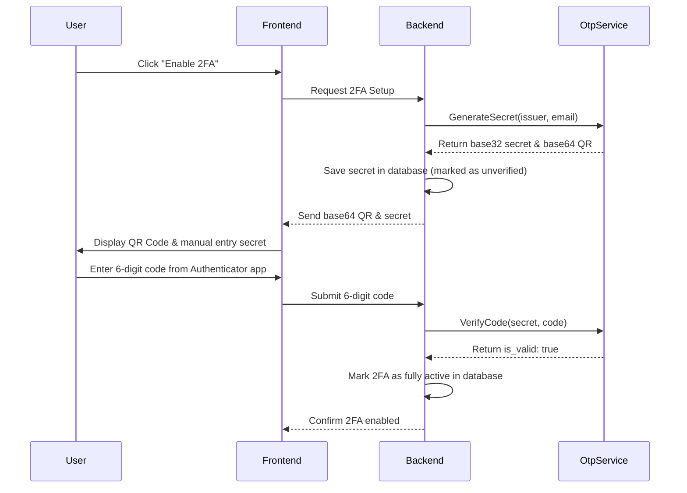
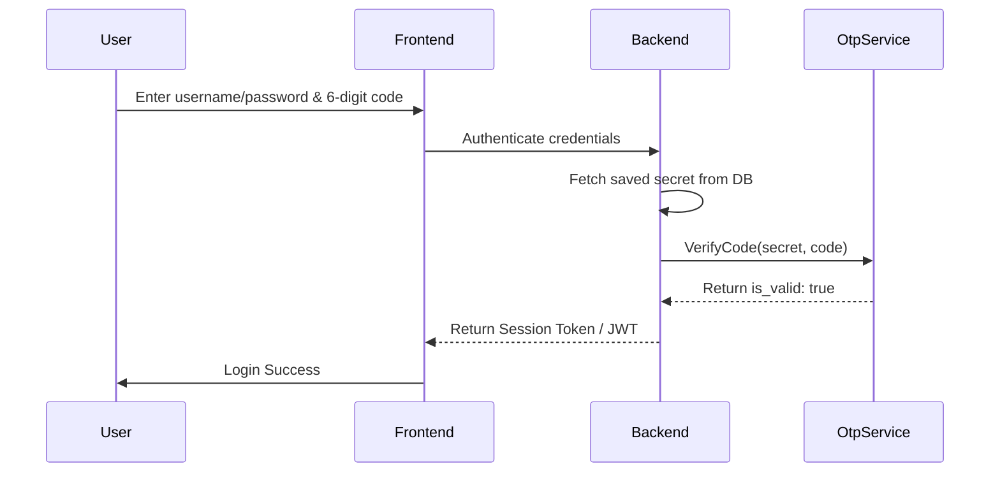

# Rust gRPC TOTP Service for 2FA / MFA

A high-performance, stateless, production-ready Rust gRPC service designed to generate and verify Time-Based One-Time Passwords (TOTP) for Two-Factor Authentication (2FA). This service generates standard configurations fully compatible with all popular authenticator applications, such as **Google Authenticator**, **Authy**, **Microsoft Authenticator**, **1Password**, and others implementing the TOTP standard (RFC 6238).

---

## Key Features

- **gRPC Transport**: Built on [Tonic](https://github.com/hyperium/tonic), an extremely fast and safe gRPC framework for Rust.
- **RFC-6238 Compliant**: Uses standard SHA1 hashing, 6-digit codes, 30-second steps, and strict drift/skew tolerance of 0 second.
- **Stateless Architecture**: The server is purely utility-based; your main database stores the Base32 secrets.
- **Easy Integration**: Returns a base64-encoded QR code PNG and an `otpauth://` URI out-of-the-box for seamless frontend integration.

---

## Project Structure

Following clean architecture principles, the project is structured as follows:

```text
.
├── Cargo.toml          # Rust dependencies & features configuration
├── build.rs            # Build-time script compiling Protobuf definition to Rust
├── proto/
│   └── otp.proto       # gRPC Protocol Buffer API contract
└── src/
    ├── main.rs         # Entry point: tracing initialization, config loading, gRPC bootstrapper
    ├── config/
    │   └── mod.rs      # Environment variable configurations parsing (host & port)
    ├── domain/
    │   ├── mod.rs      # Domain module entrypoint
    │   ├── error.rs    # Domain Error mapping structure & Tonic Status conversions
    │   └── types.rs    # Domain models (e.g. TotpSetup)
    ├── handlers/
    │   ├── mod.rs      # Handlers module entrypoint
    │   └── totp.rs     # Core business logic wrapping totp-rs
    └── services/
        ├── mod.rs      # services entrypoint & compiled protobuf module include
        └── otp_service.rs # Tonic implementation of gRPC OtpService
```

### Module Roles
- **`proto/otp.proto`**: Defines the gRPC service endpoints (`GenerateSecret` and `VerifyCode`) and request/response messages.
- **`src/config`**: Reads configuration (port, host) from environment variables `OTP_PORT` and `OTP_HOST`.
- **`src/domain`**: Holds pure types and errors. Maps standard application errors directly to gRPC statuses.
- **`src/handlers`**: Executes raw TOTP functions (generating random bytes, formatting URIs, checking current time codes).
- **`src/services`**: Maps gRPC payloads to domain calls, handles request input validation, and translates domain errors to gRPC status codes.

---

## Prerequisites

To build and run the service, you need:
- **Rust (Stable)**: 1.70+ recommended.
- **Protocol Buffers Compiler (`protoc`)**: Installed locally for Tonic to compile `.proto` files.
  - **macOS**: `brew install protobuf`
  - **Ubuntu/Debian**: `sudo apt install -y protobuf-compiler`
  - **Windows**: Download from [GitHub Releases](https://github.com/protocolbuffers/protobuf/releases) and add to `PATH`.

---

## Getting Started

### 1. Build the Project

```bash
cargo build
```

This will run the build script `build.rs`, compilation of the `proto/otp.proto` files, and compile the Rust binary.

### 2. Run the Server

```bash
cargo run
```

By default, the server listens on `127.0.0.1:50051` (IPv4 localhost). You can configure this using environment variables. Note that Rust expects a numeric IP address (such as `127.0.0.1` or `::1`); DNS hostnames like `localhost` are not supported directly by `SocketAddr` parsing:
```bash
OTP_HOST="127.0.0.1" OTP_PORT=9000 cargo run
```

### 3. Run Automated Tests

To verify code correctness:
```bash
cargo test
```

---

## Hitting the gRPC Service (Using `grpcurl`)

You can interact with the gRPC server using [grpcurl](https://github.com/fullstorydev/grpcurl).

### A. List Services
Ensure the service is running and query details:
```bash
# Using IPv4 address:
grpcurl -plaintext 127.0.0.1:50051 list

# Or using IPv6 (be sure to wrap the address in single quotes to prevent zsh globbing errors):
grpcurl -plaintext '[::1]:50051' list
```

*Note: Since reflection is not loaded by default, pass the proto file directory or file directly using the `-proto` flag.*

```bash
grpcurl -plaintext -proto proto/otp.proto 127.0.0.1:50051 list
# Output:
# otp.OtpService
```

---

### B. Generate a 2FA Secret & QR Code

Call the `GenerateSecret` RPC to create a new secret for a user.

```bash
grpcurl -plaintext \
  -proto proto/otp.proto \
  -d '{"issuer": "MyService", "account_name": "user@example.com"}' \
  127.0.0.1:50051 \
  otp.OtpService/GenerateSecret
```

#### Sample Response:
```json
{
  "secret": "KRSXG5CTMVRXEZLUKN2XAZLSKNSWG4TFOQ",
  "provisioning_uri": "otpauth://totp/MyService:user@example.com?secret=KRSXG5CTMVRXEZLUKN2XAZLSKNSWG4TFOQ&issuer=MyService&algorithm=SHA1&digits=6&period=30",
  "qr_code_base64": "data:image/png;base64,iVBORw0KGgoAAAANSUhEUgAAAPAAAADwAQAAAADd7E4FAAACqElEQVR4..."
}
```

*How to Use the Response:*
1. **`secret`**: Provide this to the user as a manual entry key if they cannot scan the QR code.
2. **`provisioning_uri`**: Standard URI format.
3. **`qr_code_base64`**: Render this string directly inside an HTML image tag: `` so the user can scan it with their authenticator app.

---

### C. Verify a 2FA Code

When the user scans the QR code and enters the 6-digit code shown in their app, call `VerifyCode` to validate.

```bash
grpcurl -plaintext \
  -proto proto/otp.proto \
  -d '{"secret": "KRSXG5CTMVRXEZLUKN2XAZLSKNSWG4TFOQ", "code": "123456"}' \
  127.0.0.1:50051 \
  otp.OtpService/VerifyCode
```

#### Sample Response (Succeeded):
```json
{
  "is_valid": true
}
```

#### Sample Response (Failed/Expired):
```json
{
  "is_valid": false
}
```

---

## Integration Guide

### 1. Registration Flow


### 2. Login Flow


---

## Containerization & Deployment

This service is fully containerized and ready to be deployed to Docker environments and Kubernetes clusters.

### 1. Docker

#### Build the Docker Image
To build the optimized release Docker image (using the multi-stage `Dockerfile` which keeps the final image lightweight):
```bash
docker build -t totp-service:latest .
```

#### Run the Container Locally
Run the container and map the gRPC port `50051`:
```bash
docker run -d \
  --name totp-service \
  -p 50051:50051 \
  totp-service:latest
```

*Note: Inside the Docker container, the service defaults to `OTP_HOST=0.0.0.0` and `OTP_PORT=50051` so it is reachable externally.*

#### Overriding Config via Environment Variables
If you want to run the container on a custom port or change logging verbosity:
```bash
docker run -d \
  --name totp-service \
  -p 9000:9000 \
  -e OTP_PORT=9000 \
  -e RUST_LOG=debug \
  totp-service:latest
```

#### Connecting to the Docker Container
You can hit the containerized service exactly like the local service:
```bash
grpcurl -plaintext -proto proto/otp.proto 127.0.0.1:50051 otp.OtpService/GenerateSecret
```

---

### 2. Kubernetes

To run the gRPC TOTP service in a Kubernetes cluster, we define a **Deployment** (which manages the container replica) and a **Service** (which exposes the deployment).

Here are the standard manifest files.

#### Deployment & Service Manifest (`k8s/k8s.yaml`)

You can create a file named `k8s/k8s.yaml` with the following content:

```yaml
apiVersion: apps/v1
kind: Deployment
metadata:
  name: totp-service
  labels:
    app: totp-service
spec:
  replicas: 2
  selector:
    matchLabels:
      app: totp-service
  template:
    metadata:
      labels:
        app: totp-service
    spec:
      containers:
        - name: totp-service
          image: totp-service:latest # Replace with your registry image path, e.g., myregistry.com/totp-service:latest
          imagePullPolicy: IfNotPresent # Or Always in production
          ports:
            - containerPort: 50051
              name: grpc
          env:
            - name: OTP_HOST
              value: "0.0.0.0"
            - name: OTP_PORT
              value: "50051"
            - name: RUST_LOG
              value: "info"
          resources:
            limits:
              cpu: "500m"
              memory: "256Mi"
            requests:
              cpu: "100m"
              memory: "64Mi"
          # Since the binary supports dynamic reflection and starts quickly, we can run basic probes:
          readinessProbe:
            exec:
              command: ["/app/otp", "--help"]
            initialDelaySeconds: 5
            periodSeconds: 10
          livenessProbe:
            exec:
              command: ["/app/otp", "--help"]
            initialDelaySeconds: 10
            periodSeconds: 15
---
apiVersion: v1
kind: Service
metadata:
  name: totp-service
  labels:
    app: totp-service
spec:
  ports:
    - port: 50051
      targetPort: 50051
      name: grpc
  selector:
    app: totp-service
  type: ClusterIP
```

#### Deploy to the Cluster
Apply the manifests to your Kubernetes cluster:
```bash
kubectl apply -f k8s/k8s.yaml
```

Check the status of the pods:
```bash
kubectl get pods -l app=totp-service
```

#### Delete / Tear Down the Cluster Resources
To clean up and remove the deployment and service from the cluster:
```bash
kubectl delete -f k8s/k8s.yaml
```

---

### 3. Connecting to the Service in Kubernetes

Depending on where you are calling the service from, here is how you connect:

#### A. Inside the Kubernetes Cluster (Service-to-Service communication)
Other microservices running in the same cluster can connect to this service using its Kubernetes DNS name:
- **Connection String**: `totp-service.default.svc.cluster.local:50051` (assuming deployed in the `default` namespace)
- **Short Name**: `totp-service:50051` (if the calling service is in the same namespace)

For example, from another container inside the cluster:
```bash
grpcurl -plaintext -proto proto/otp.proto totp-service:50051 list
```

#### B. Outside the Kubernetes Cluster (For Testing / Local Development)
If the Service type is `ClusterIP`, it is not directly reachable from your local machine. You can connect using `kubectl port-forward`:

1. Start port forwarding:
   ```bash
   kubectl port-forward service/totp-service 50051:50051
   ```
2. In a separate terminal, access the service on `localhost:50051`:
   ```bash
   grpcurl -plaintext -proto proto/otp.proto 127.0.0.1:50051 list
   ```

#### C. Production Outside Access (Ingress / LoadBalancer)
To expose the gRPC service externally in production:
1. **LoadBalancer Service**: Change the service type to `LoadBalancer` to assign a public cloud load balancer IP:
   ```yaml
   spec:
     type: LoadBalancer
   ```
2. **gRPC Ingress**: Use an ingress controller like NGINX Ingress Controller configured for gRPC (using `nginx.ingress.kubernetes.io/backend-protocol: "GRPC"` annotation).

